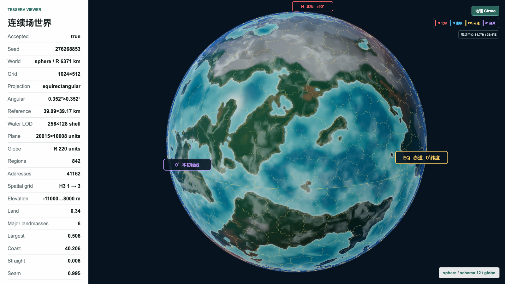

  以 AI 工具、游戏开发与工程实验为主线，持续补齐渲染、优化、系统与模型训练能力。

  AI Tooling · Game Development · Rendering · Optimization · Systems · LLM Training

## 关于这里

这里主要记录我正在推进的开源项目，以及一些持续打磨中的工具、工作流和游戏原型。

## 当前重点

### [Sky Island Rebirth](https://github.com/zgx197/sky-island-rebirth)

以一款实际运行的游戏为核心，持续验证 Babylon.js 的引擎能力、项目侧 ECS、场景组织、运行时可观测性、性能边界与智能体辅助调试流程。

当前里程碑：建立可观测的最小 ECS 游戏运行闭环

近期迭代目标：
1. 完成纯逻辑 ECS smoke flow，并持续记录实体、组件、系统耗时和帧状态。
2. 通过真实场景验证 Babylon.js 的渲染、资源、编辑器接入、调试和性能能力。
3. 明确第一段可玩的核心循环，让后续技术建设始终服务于游戏体验。
4. 从实际玩法中提炼世界、区域和局部地图需求，再把经过验证的能力沉淀到 Tessera。

### [Tessera](https://github.com/zgx197/Tessera)

Tessera 调整为由实际游戏需求驱动的世界与地图技术基线，不再脱离项目去想象完整的通用世界生成框架。现有确定性世界生成原型会继续保留；当 Sky Island Rebirth 真正需要世界尺度、区域划分、局部地图、地貌、水文、气候、持久化或 LOD 时，再针对明确的玩法问题继续完善。

  
查看 Tessera 当前技术基线截图

  

    
  

## 项目与实验

### 持续项目

- **[TileMatcher](https://github.com/zgx197/TileMatcher)**  
  迭代中 · 游戏与玩法  
  继续补玩法反馈、关卡表现和宠物养成内容。

- **[Sideline](https://github.com/zgx197/Sideline)**  
  迭代中 · 游戏与运行时  
  继续验证玩法循环，并沉淀运行时和 UI 框架能力。

- **[design-to-facet](https://github.com/zgx197/design-to-facet)**  
  整理中 · 设计到交付  
  继续整理设计到页面结构、组件协议和交付约束。

- **[SceneBlueprint](https://github.com/zgx197/SceneBlueprint)**  
  探索中 · 工具链  
  继续验证蓝图数据结构、运行协议和多引擎接入方案。

### 学习与实验

- **游戏引擎使用与工程经验**  
  计划中 · 待创建  
  继续沉淀 Unity / Godot 在组件组织、资源管理、调试流程和常见开发问题上的实践经验。

- **游戏渲染**  
  学习中 · [gfx-practice](https://github.com/zgx197/gfx-practice)  
  继续围绕通用游戏渲染管线、渲染特性与图形效果实现做拆解、练习与记录。

- **游戏优化**  
  计划中 · 待创建  
  针对 GC 优化、DrawCall 优化和运行时开销做小型验证项目。

- **语言模型训练**  
  学习中 · [MiniMind](https://github.com/jingyaogong/minimind)  
  跟着源码梳理从零开始的 PyTorch 训练流水线，并补自己的实验记录。

- **工程与交互设计**  
  计划中 · 待创建  
  继续拆解 Claude Code 的整体架构、交互设计和工程组织方式。

- **排版系统与文档工程**  
  学习中 · [pretext](https://github.com/zgx197/pretext)  
  继续理解文档生成、结构化内容组织和工具链设计。

-----
